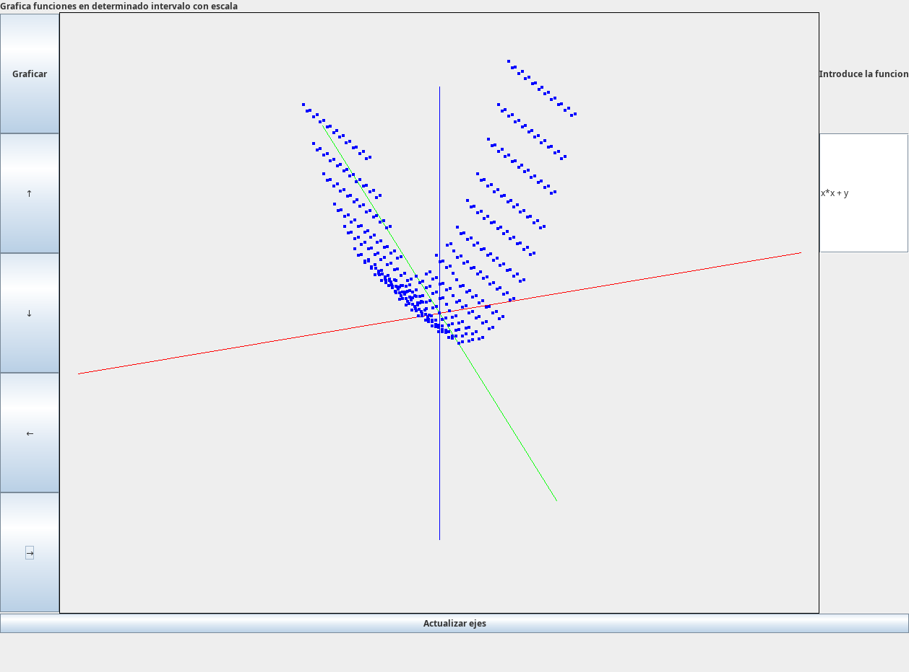

# Graficador 3D de Funciones

Tarea de la UNI - Curso de programacion II

---

Esto fue una tarea que hice hace años en la universidad. El objetivo inicial era simple: graficar una función f:RxR->R y mostrar su proyección 3D en 2D. Nada del otro mundo.

Cuando comencé esta tarea, parecia mas laborioso que compleja. Teniamos que leer el input y limpiar el string, que no tuviera espacios de mas, que si junto algunos simbolos pero otros no, cosas que suelen ocurrir. La cosa pintaba bien. Una vez que teniamos la funcion, la convertiamos a notación postfija para poder evaluarla, se usaba una pila listo. La evaluacion era parte "simple" porque estableces el rango de tus conjutos en el dominio y listo, cambias las incognitas en la notacion postfija y wala, tienes los valores de tu funcion.

Aqui es donde se comenzo a poner mas interesante. En un inicio, pues si, tengo cuanto vale cada punto, pero, ¿y donde se debe visualizar ese punto?
Para este punto, el profesor nos recomendo hacer una proyeccion, pasamos de 3D a 2D usando triangulos. La cosa no estaba tan compleja por si misma. Pero... ¿y que tal que pudiera girar?

Digo, todos queremos mover la grafica, verla desde otro punto, vwe ese cambio en la superficie, en otras palabras, ggenerar la malla de puntos, poder girarla y renderizarla. Pero la proyeccion con triangulos ya no funcionaba porque ahi no estas "rotando", solo estas proyectando con las mismas coordenadas rectangulares. La solucion debia ser usar angulos.

Para que una pantalla pinte un pixel, tiene una matriz donde esta la ubicacion de cada pixel, una memoria RAM tiene celdas de informacion y estos y otros eleentos se representan por coordenadas rectangulares, es decir, puedes recorrerlos con 2 ciclos anidados pero para el caso de querer rotar 13 grados, no es como que rapidamente puedas saber en que nueva celda debera dibujarse. La solucion mas simple a mi parecer estaba en usar angulos, ¿pero como saber donde debe dibujarse la linea?

Podemos transformar coordenadas, eso no es nuevo, pero el problema real no era es si puedo transformar las coordenadas, mas bien era donde deben dibujarse. Y bueno, como todo bien fisico, te imaginas el caso mas simple posible, ver unicamente 2 planos. Si roto con respecto a un punto "origen" y estoy alineado al eje X, entonces solo puedo ver el plano YZ. Aqui, toda linea sobre el eje X debe verse como un punto. Ahora, si me alineo al eje Y, ahi si se ven como lineas. Imagina el vector (3,0,0), enotnces desde el eje X, es un punto sobre el origen, pero desde el eje Y se ve como una linea que sale del origen y mide 3 unidades. Y en los puntos intermedios, rayos, ahi no siempre mide 3 u. Y si agregamos otra componente, ej, el punto (3,0,1), bueno, en el eje X es un punto sobre el origen a 1 unidad de altura, pero es un putno... 

La pantalla no entiende de ángulos, usa matrices de píxeles. Se me ocurrio que así como en una circunferencia unitaria con centro en el origen, la posición x se determina con el coseno, ¿por qué no aplico lo miso pero unicamente para puntos del plano XY?

Con esto, 3*sen(theta) le da esa longitud en pantalla. Claro que esto solo aplica para un plano, para el caso de un espacio 3D, debia no solo transformar las coordenadas polares a rectangulares sino que segun el ángulo de rotación, debia modificar la longitud respecto del origen. Fue aqui donde modifique un poco la funcion de transformacion multiplicando por funciones trigonometricas con la funcion que no solo tener el valor en rectangulares, sino que directamente entregaba su posicion en la pantalla.



#### - No era MATLAB, no iba a cambiar el mundo, pero era mío y funcionaba -

---

## Lo que tomo su tiempo (porque eran otras épocas)

No voy a mentir, esto tomo su buen rato. No era solo "mete la función y ya". Había que:

- **Limpiar el input**: Sacar espacios, que tal poner a PI o al numero de Euler, pero no quiero poner 3.14..., pues ponemos una letra.. Habia que agregar parentesis implicitos porque si no, la evaluacion fallaba..

- **Conversión infijo a postfijo**: Para evaluar una expresión como `x + y * 2`, primero había que pasarla a notación postfija usando una pila. Me libraba de parsearla con recursividad y otras cosas.

- **Evaluación punto a punto**: Una vez con la expresión en postfijo, evaluar cada punto de la malla. 

- **La transformación**: Ya existían las matrices de transformación, pero lo que buscaba era algo más intuitivo: que la "longitud visual" de cada eje dependiera de funciones trigonométricas. No era solo rotar, era que `sin(θ)` y `cos(φ)` determinaran exactamente cuánto se ve de cada dimensión. Eso fue lo más interesante de todo.

Fue de las pocas tareas donde sentí que todo encajó: las matemáticas, la lógica, el resultado en pantalla. Fue poco antes de que existiera la IA y era un poco más "duro" programar

---

## Cómo funciona

1. **Evaluación**: Se limpia el input, se convierte la expresión a postfijo con una pila, y se evalúa en cada punto de la malla.

2. **Malla**: 21x21 puntos en el dominio [-5, 5].

3. **Transformación 3D->2D**:
   ```
   screen_x = cx - sin(θ)·x + cos(θ)·y
   screen_y = cy + sin(φ)·cos(θ)·x + sin(φ)·sin(θ)·y + cos(φ)·z
   ```

## Controles

- **Flechas / Botones**: Rotar la vista (0° a 90°)
- **Campo de texto**: Función con `x` e `y` (ej: `x*x + y*y`)
- **Graficar**: Renderiza

## Ejecutar

```bash
javac *.java
java main
```

## Archivos

- `main.java` - Entry point
- `Ventana.java` - UI
- `Plano.java` - Rendering y transformaciones
- `Pila.java` - Evaluador de expresiones

---

## Ideas para crecer (quizá algún día)

- Más resolución (la grilla 21x21 se queda corta)
- Mejor parsing de input (actualmente es básico)
- Graficar campos vectoriales
- Colores según pendiente o altura
- Exportar a imagen

---

